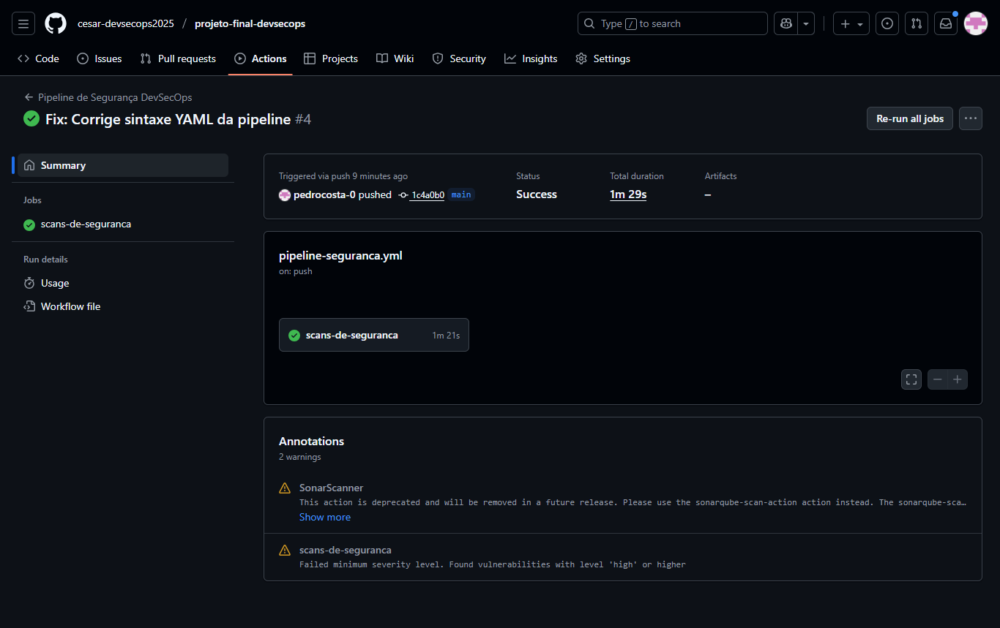

# Projeto Final de DevSecOps: SecureTasks

Este projeto demonstra a implementação de uma esteira de segurança (CI/CD) para a startup fictícia "SecureTasks", aplicando os conceitos da cultura DevSecOps para identificar vulnerabilidades de forma automatizada.

## 1. Visão Geral da Arquitetura

O objetivo foi integrar a segurança no ciclo de vida de desenvolvimento de uma aplicação web vulnerável, a **OWASP Juice Shop**. Para isso, foi construída uma pipeline no **GitHub Actions** que executa três tipos de análises de segurança a cada alteração no código:

1.  **SAST (Static Application Security Testing):** Análise do código-fonte em busca de falhas de programação, utilizando o **SonarCloud**.
2.  **SCA (Software Composition Analysis):** Verificação das dependências e bibliotecas de terceiros em busca de vulnerabilidades conhecidas, utilizando **Anchore/Syft**.
3.  **Container Scanning:** Análise da imagem Docker da aplicação em busca de vulnerabilidades no sistema operacional e pacotes, utilizando **Trivy**.

Toda a infraestrutura para rodar a aplicação localmente é gerenciada como código através do **Docker Compose**.

## 2. Como Executar o Projeto Localmente

**Pré-requisitos:**
* Docker Desktop instalado e rodando.
* Git instalado.

**Passos:**
1.  Clone este repositório:
    ```bash
    git clone [https://github.com/cesar-devsecops2025/projeto-final-devsecops.git](https://github.com/cesar-devsecops2025/projeto-final-devsecops.git)
    cd projeto-final-devsecops
    ```
2.  Suba a aplicação com o Docker Compose:
    ```bash
    docker-compose up -d
    ```
3.  Acesse a aplicação no seu navegador em: `http://localhost:3000`

## 3. Evidências da Execução da Pipeline

A pipeline foi configurada para rodar a cada `push` na branch `main`. Abaixo estão as evidências da sua execução bem-sucedida e dos resultados das ferramentas.

### 3.1. Sucesso na Execução da Pipeline no GitHub Actions

A imagem abaixo mostra a pipeline sendo executada com sucesso, com todos os jobs (SAST, SCA, Container Scanning) finalizados.



### 3.2. Relatório do Trivy (Container Scanning)

O Trivy encontrou diversas vulnerabilidades na imagem base do Juice Shop. O relatório abaixo, extraído do log da pipeline, destaca as falhas de severidade `CRITICAL` e `HIGH`.

-1.png)
-2.png)

### 3.3. Relatório do Anchore (Análise de Dependências - SCA)

A análise de SCA também identificou vulnerabilidades nas bibliotecas utilizadas pela aplicação, confirmando que a nossa esteira é capaz de detectar esse tipo de risco.


### 3.4. Dashboard do SonarCloud (Análise de Código - SAST)

O código-fonte do Juice Shop foi analisado pelo SonarCloud, que identificou centenas de "Code Smells", bugs e algumas vulnerabilidades. O dashboard abaixo resume a qualidade e a segurança do código.

.png)

---